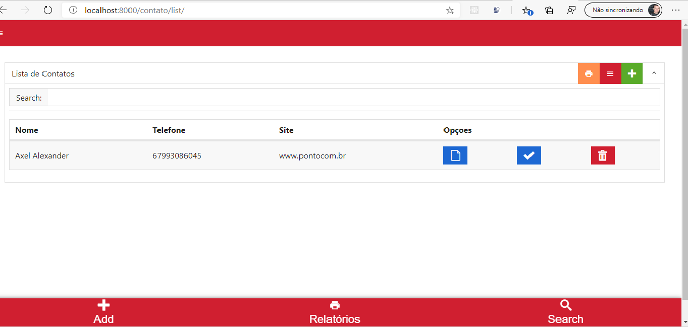

# Projeto
  agenda de contatos em python e django

## projeto
- PYTHON
- MYSQL
- DJANGO
- METRO 4 CSS

# DEMO

# Python and pipenv 
- (linux) apt-get install python3-mysqldb libmysqlclient-dev python-dev
- pip3 install pipenv
- pipenv install django==2.2.0 
- pipenv install mysqlclient 

- pipenv shell  `execute to path project`
✔ Successfully created virtual environment! 
Virtualenv location: /home/axel/.local/share/virtualenvs/pycontato-TG8PuaBm
Launching subshell in virtual environment…
. /home/axel/.local/share/virtualenvs/pycontato-TG8PuaBm/bin/activate

# git
  - $ git init
  - $ git config --global user.name "nome"
  - $ git config --global user.email blabla@gmail.com
  - $ ls .git
  - $ git remote add origin git@github.com:codpuer/tutorial-github.git

## Baixar(pull=puxar) o projeto:
- $ git pull origin master
- $ git fetch origin

# cmd window python

- C:\>set PATH=C:\Program Files\Python 3.5;%PATH%
- C:\>set PYTHONPATH=%PYTHONPATH%;C:\My_python_lib

## virtualenv

- pip install virtualenv

# django command
- django-admin startproject myproject `Create a Project` 
- python ./manage.py startapp nome_app  `start app`
- python manage.py migrate  `migrate`
- python manage.py createsuperuser  `super user`
- python manage.py runserver 8000 `rum server port 8000 ou python manage.py runserver`

# COMANDOS PYCHARM
Ctrl+Alt+R = manage py console
- runserver     = + porta 8000
- manage.py@teste > makemigrations         `criar tabelas para o novo modelo`
- manage.py@teste > sqlmigrate polls 0001  `mostra o sql gerado`
- manage.py@teste > createsuperuser   `cria super usuario`
- manage.py@teste > migrate                 `Finalmente, execute o comando migrar para realmente criar essas tabelas em seu banco`
